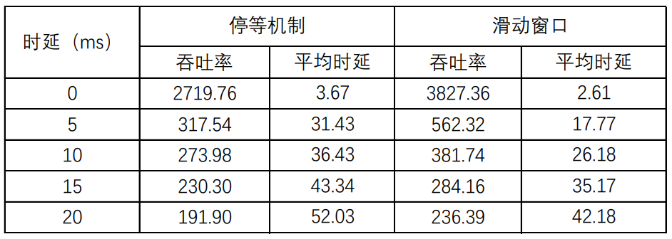
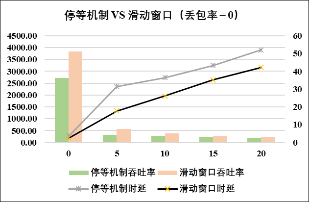
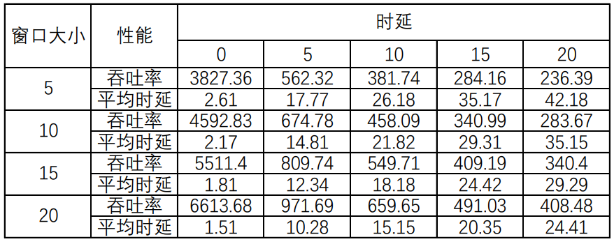
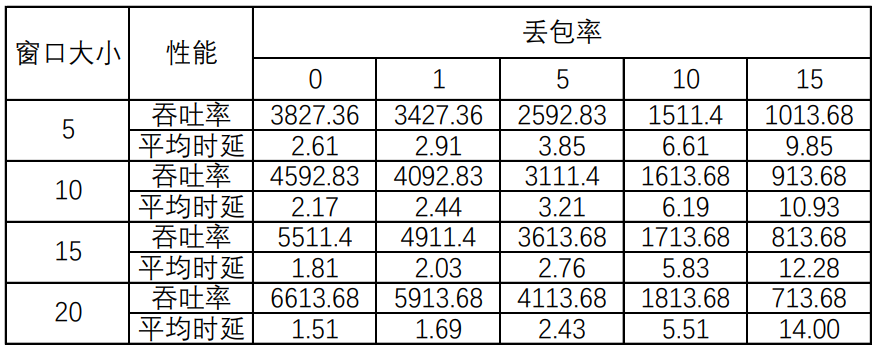
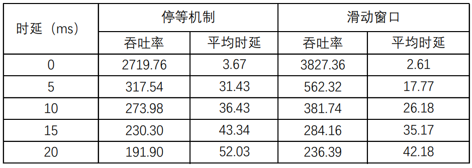
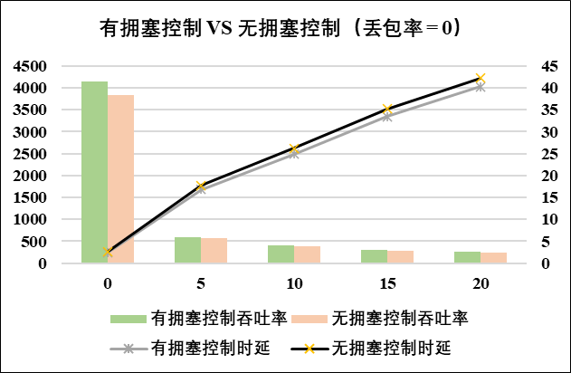

# 计算机网络实验报告

## Lab3-4 基于UDP服务设计可靠传输协议并编程实现

###### 网络空间安全学院 物联网工程专业 2212039 田晋宇

[jassary08/Computer_Network (github.com)](https://github.com/jassary08/Computer_Network)

## 实验要求

**基于给定的实验测试环境，通过改变延时和丢包率， 完成下面3组性能对比实验：**

（1）停等机制与滑动窗口机制性能对比；

（2）滑动窗口机制中不同窗口大小对性能的影响；

（3） 有拥塞控制和无拥塞控制的性能比较。

## 实验内容

我们通过对测试文件**2.jpg**的传输，每个包的大小设置为**10240Bytes**，设置了以下三组对比实验：

- **停等机制与滑动窗口机制性能对比：**设置丢包率为0，在不同时延下比较停等机制与滑动窗口机制的吞吐率，平均时延以及传输时间。
- **滑动窗口机制中不同窗口大小对性能的影响：**在丢包率及时延相同的情况下，通过改变窗口大小，测试滑动窗口机制的吞吐率，平均时延以及传输时间
- **有拥塞控制和无拥塞控制的性能比较：**设置丢包率为0，在不同时延下比较有拥塞控制和无拥塞控制的吞吐率，平均时延以及传输时间。

## 实验结果

### 1.停等机制与滑动窗口机制性能对比

- **性能对比**

  

- **可视化分析**

  

**吞吐率方面：** 滑动窗口机制在各个时延条件下的吞吐率明显优于停等机制，特别是在低时延环境下效果最佳。

**平均时延方面：** 滑动窗口机制的平均时延始终低于停等机制，且随时延增加的劣化程度较小。

**原因分析：**滑动窗口机制在数据传输过程中引入了**流水线式传输**，多个数据包同时发送，从而大幅减少了传输链路上的等待时间和确认时间对平均时延的影响。因此，滑动窗口机制的平均时延远低于停等机制，尤其在高时延环境下更为明显。

### 2.滑动窗口机制中不同窗口大小对性能的影响

1. **丢包率为0，在不同时延条件下的不同滑动窗口大小的性能对比**

   - **性能对比**

     

   - **可视化分析**

     

   **吞吐率：** 随着**滑动窗口大小的增大**，在所有时延条件下，吞吐率逐步提高。较大的窗口大小能够有效提升链路利用率，尤其在高时延条件下表现更加明显。

   **平均时延：** 平均时延随着窗口大小的增大而略有降低，表明更大的窗口能够减少数据传输中的等待时间

   **总体结论：** 滑动窗口大小决定了发送方在未接收到确认之前，能连续发送的最大数据量。窗口越大，发送方能保持更多的数据流动，链路利用率越高。在高时延下，发送方等待确认的时间较长，小窗口导致链路空闲时间增加。而大窗口则有效缓解了时延影响，使吞吐率维持在较高水平，平均时延也有所降低。在低时延环境中，链路本身的性能瓶颈较小，窗口增大进一步挖掘了带宽潜力，提升了吞吐率。

2. **时延为0,在不同丢包率条件下不同滑动窗口大小的性能对比**

   - **性能对比**

     

   - **可视化分析**

     

   **吞吐率：** 丢包率增加导致吞吐率显著下降，但较大的窗口能有效缓解丢包影响，保持更高的吞吐率。但在丢包率为15%时，窗口大小越大，反而带来了性能下降。

   **平均时延：** 随着丢包率增加，平均时延逐步上升，反映出数据重传导致的时延累积；同时，窗口越大，平均时延增长趋势更缓慢。

   **原因分析：**在滑动窗口机制中，**窗口越大**，发送方可以连续发送更多数据，而不必等待确认。然而，当网络丢包率较高（如 15%）时，窗口越大会带来更严重的问题：当窗口较大时，发送方一次性发送的数据量较多，若丢失一个或多个分组，接收方无法按序接收，导致发送方必须等待超时或进行重传。较大的窗口导致一次性传输的数据量较多，丢失分组后重传的数据量同样较大，进一步增加网络负载，影响整体吞吐率。丢包导致的确认超时触发重传的概率增加，进一步拖慢数据传输速度，导致性能下降。

### 3.有拥塞控制和无拥塞控制的性能比较

- **性能对比**

  

- **可视化分析** 

  

**吞吐率：** 在所有时延条件下，有拥塞控制的**吞吐率略高于无拥塞控制**，特别是在低时延情况下表现明显。随着时延增加，吞吐率均呈下降趋势，但有拥塞控制的优势依然存在。

**平均时延：**在所有时延条件下，有拥塞控制的平均时延**略低于无拥塞控制**。随着时延增加，平均时延呈逐步上升趋势，但有拥塞控制的时延增长更为平缓。

**原因分析：** 拥塞控制机制通过**检测网络拥塞**，动态调整发送速率和数据流量，防止网络过载，保持数据流的稳定传输。这一机制在低时延和正常网络状态下尤其有效，提升了链路利用率和传输效率，降低了时延。在无拥塞控制的情况下，数据传输不考虑网络拥塞状态，可能导致链路过载，尤其在时延较高时表现出更严重的性能劣化，吞吐率较低，平均时延较高。

## 实验结论

本次实验通过对基于UDP服务的可靠传输协议的设计与实现，从停等机制、滑动窗口机制以及拥塞控制三个方面进行了性能对比分析。实验的主要内容涵盖了**时延**和**丢包率**对数据传输效率（吞吐率和平均时延）的影响，通过实验分析，得出了以下结论：

1. **停等机制与滑动窗口机制性能对比：**
   - **滑动窗口机制**在吞吐率和平均时延上均优于停等机制，尤其在高时延场景下优势更加明显。
   - 滑动窗口机制通过**流水线传输**优化了链路利用率，减少了确认等待时间的影响，使数据传输更加高效。
2. **滑动窗口机制中窗口大小的影响：**
   - 随着**窗口大小的增大**，在丢包率较低或无丢包的情况下，吞吐率显著提高，且平均时延降低，表现出明显的优化效果。
   - 当丢包率较高（如15%）时，窗口过大反而导致性能下降，这是由于**重传数据量增加**和**链路负载加重**引起的。因此，需根据实际网络情况调整窗口大小，避免性能劣化。
3. **有拥塞控制与无拥塞控制的性能比较：**
   - 有拥塞控制机制在所有时延条件下均优于无拥塞控制，能够动态调整数据发送速率，**缓解网络过载**问题，使吞吐率更高，时延更低。
   - 拥塞控制在低时延环境下效果尤为显著，体现了其在优化传输性能方面的关键作用。